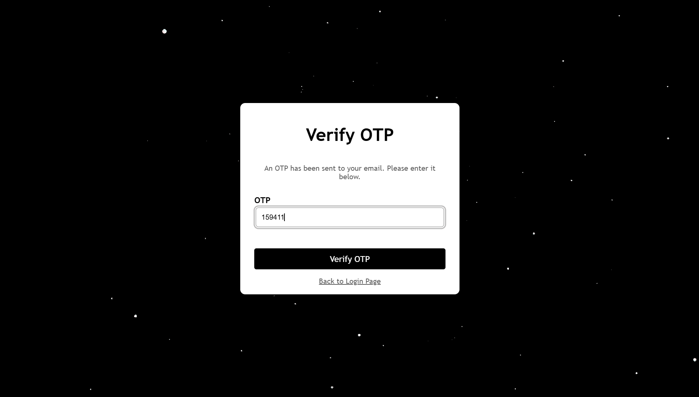
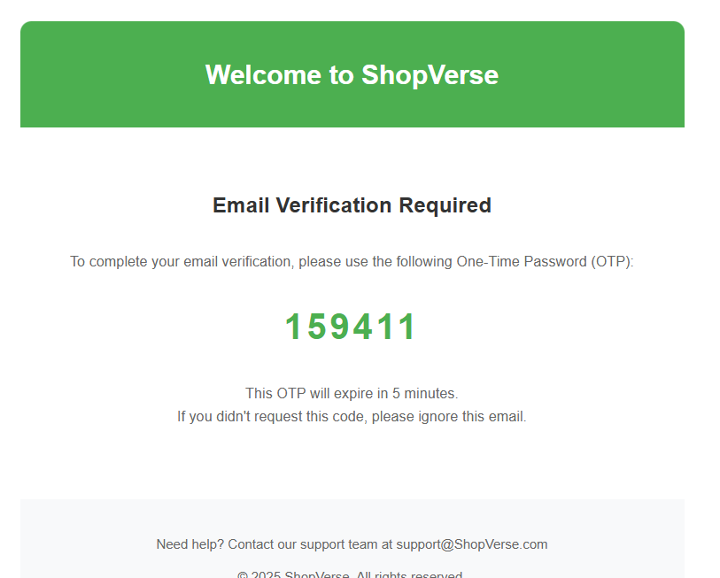

# 🛍️ ShopVerse – A Full-Stack E-Commerce Platform

## 🚀 Overview

ShopVerse is a scalable e-commerce platform offering seamless shopping and product management with robust authentication and security.

## 🌟 Features

### 🛒 Customers

- Users can explore products by category, view detailed information, and utilize search functionality.
- Add products to the cart, adjust quantities, and view total pricing.

### 🛍️ Sellers

- Add, update, and delete products with images
- Manage inventory and orders

### 🔒 Security

- JWT-based authentication with role-based access control
- Data protection best practices

## ⚙️ Tech Stack

**Frontend:** React, Material-UI, Context API  
**Backend:** Spring Boot, MongoDB, Cloudinary

## 🧪 Sample Credentials for Testing

### Seller and Customer Account

- **Email:** nikhil.nambula@gmail.com
- **Password:** 123456

### Customer Account

- You can create an customer account, securily integrated with email verification.

## 🛠️ Setup

### Prerequisites

- **Node.js**, **Java (JDK 11+),** **MongoDB**

### Installation

1. Clone repositories:
   ```bash
   git clone https://github.com/Nikhil-sai-nambula/ShopVerse.git && cd ShopVerse
   git clone https://github.com/Nikhil-sai-nambula/e-commerce-application.git && cd e-commerce-application
   ```

### Register as Customer


### OTP Verification





### Login


